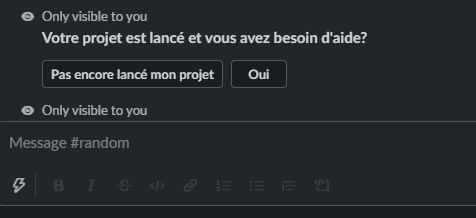
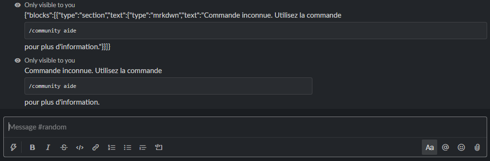

# Message Interactivity problems

In the hope that some competent "slacker" ;-) comes this way...

## The issues

I have two issues:

+ I am failing to respond to interactivity emanating from blocks, despite correctly detecting it and parsing it;

+ Responses I send to buttons which use legacy formatting (`attachements`) must also be formatted in that legacy format.

:warning: I'm a total web and `node.js` noob, so the answer may be extremely obvious.

### In pictures

#### Issue 1

Absence of response to a block, this would be the best solution, new format block questions, being answered by other blocks:




#### Issue 2

incorrect formatting of a response from the working message buttons. The following image shows the broken message first followed by the dangerous fix suggested later.



### My questions

+ Am I missing something to do with the "way the web works" a hand-shake type step stopping my block message being received.

+ Am I missing a step in the definition of the blocks?

+ Am I incorrectly sending them back?

+ Whose bug is this?

## App setup

I followed the tutorial on [How to develop a slack app locally using ngork](https://api.slack.com/tutorials/tunneling-with-ngrok)

    ngork http 8000

So in the Slack app I configure the slash command and interactive `url` to my ngork address:

    node server.js

Now the app is running and succesfully answers questions.

## App structure

As I mentioned, I have no experience with `javascript`, `node.js` and anything to do with web connectivity.

Following Slack's guides the `server.js` looks something along the lines of:

```js
var express = require("express");
var bodyParser = require("body-parser");
var app = express();

// Do some preprocessing stuff

// Define the function used to respond
function respondToCommand(incoming_cmd) {
    // In fact parses which file and answer to send back
    // but does no other processing of the object
    answer = require('./messages/some-block-structure.json');
    return answer;
}

// Respond to slash commands
app.post('/',function(req,res){
    incoming_cmd = req.body.text;
    answer = respondToCommand(incoming_cmd);
    res.send(answer)
});

// Responds to interactive commands
app.post('/response',function(req,res){
    req_payload = JSON.parse(req.body.payload);  // parse payload
    incoming_cmd = req_payload.actions[0].value;  // Extract command
    answer = respondToCommand(incoming_cmd);  
    res.send(answer)
});
```

## Contents of message files

These are JSON files loaded via `require` and the object resulting is passed directly to the `res.send(...)`, is this the issue?

The function `respondToCommand` could actually be to show the two issues:

```js
// Define the function used to respond
function respondToCommand(incoming_cmd) {
    // In fact parses which file and answer to send back
    // but does no other processing of the object
    if (incoming_cmd == "question-message") {
      answer = require('./messages/question-message.json');

    } else if (incoming_cmd == "question-block")
        answer = require('./messages/some_answer.json');

    } else if (incoming_cmd == "some-answer")
        answer = require('./messages/some-answer.json');

    } else {
        answer = "";
    }
    return answer;
}

```

### Legacy buttons: `./messages/question-message.json`

This message generates buttons in a legacy format using the `attachments` property. This one works and can be responded to, however not by a message in block format

```json
{
    "text": "*Votre projet est lancé et vous avez besoin d'aide?*\n",
    "attachments": [
        {
            "fallback": "Boutons cassés please proceed to `trouve-aide` ou `nouveau-projet`",
            "color": "#3AA3E3",
            "callback_id": "interactif-besoin-aide",
            "attachment_type": "default",
            "actions": [
                {
                    "name": "besoin-aide",
                    "type": "button",
                    "text": "Pas encore lancé mon projet",
                    "value": "some-answer"
                },
                {
                    "name": "besoin-aide",
                    "type": "button",
                    "text": "Oui",
                    "value": "some-answer"
                }
            ]
        }
    ]
}
```

### The response: `./messages/some-answer.json`

A simple message in block form, while the block form is not needed here, it is useful in the actual app.

```json
{
    "blocks": [
        {
            "type": "section",
            "text": {
                "type": "mrkdwn",
                "text": "Commande inconnue. Utilisez la commande ```/community aide``` pour plus d'information."
            }
        }
    ]
}
```

The JSON is treated as plain text and appears like so:


#### A simple but unscalable fix

Add a fallback legacy message in the JSON, copying the text of the first section into the text of the whole message:

```js
// Responds to interactive commands
app.post('/response',function(req,res){
    req_payload = JSON.parse(req.body.payload);  // parse payload
    incoming_cmd = req_payload.actions[0].value;  // Extract command
    answer = respondToCommand(incoming_cmd);  

    try { // Add a legacy fallback to the answer if it uses blocks
        answer.text = answer.blocks[0].text.text;
        if (answer.text = answer.blocks[0].text.type == "mrkdwn"){
            answer.mrkdwn = true;
        }
    } catch(err){}

    res.send(answer)
});
```

it works but it ain't pretty or robust.

### Sending buttons in blocks: `./messages/question-block.json`

Maybe this is because a legacy message cannot receive a more recent "blocked" message. 
Sort of makes sense. Let's then send a block message that does the same as `question-message.json`: 

```json
{
    "blocks": [
        {
            "type": "section",
            "text": {
                "type": "mrkdwn",
                "text":  "*Votre projet est lancé et vous avez besoin d'aide?*\n"
            }
        },
        {
            "type": "actions",
            "elements": [
                {
                    "type": "button",
                    "action_id": "interactif-besoin-aide/nouveau-projet",
                    "value": "some-answer",
                    "text": {
                        "type": "plain_text",
                        "text": "Pas encore lancé mon projet"
                    }
                },
                {
                    "type": "button",
                    "action_id": "interactif-besoin-aide/trouve-aide",
                    "value": "some-answer",
                    "text": {
                        "type": "plain_text",
                        "text": "Oui"

                    }
                }
            ]
        }
    ]
}
```

These buttons appear with a slightly different look to the others (not as attachment). 
When these buttons are clicked a little scroll wheel appears for 3 seconds, and then nothing.
There is no error, and the server correctly receives the message and sends the expected answer.

+ What is missing either in these blocks or in my processing of the response to make it work?
+ Is the `callback_id` needed for these block buttons alson needed?
